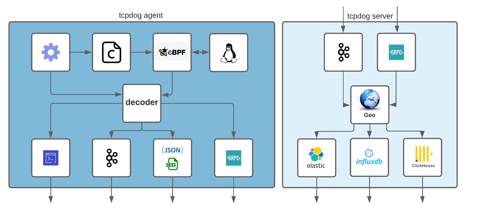
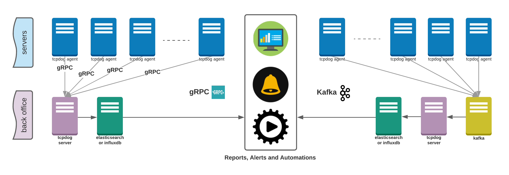
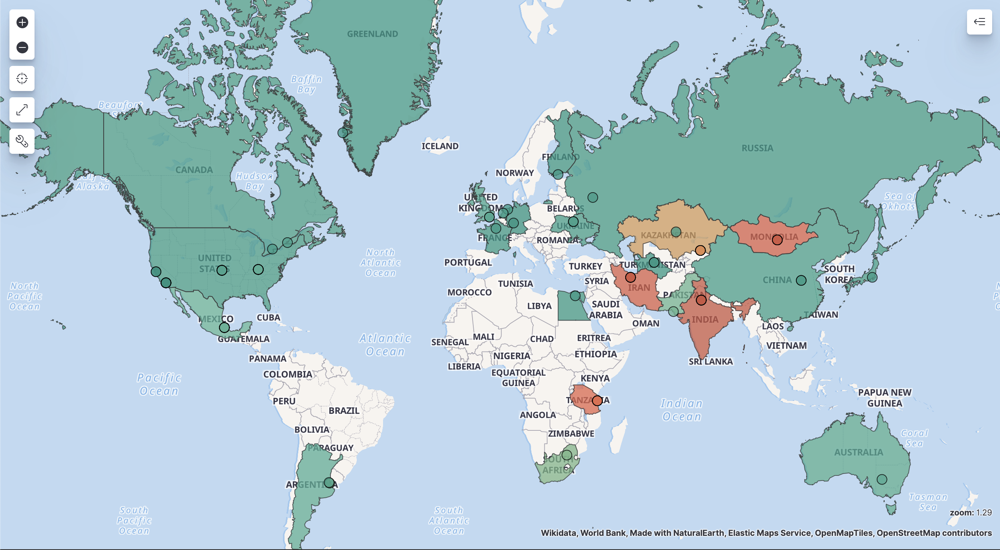
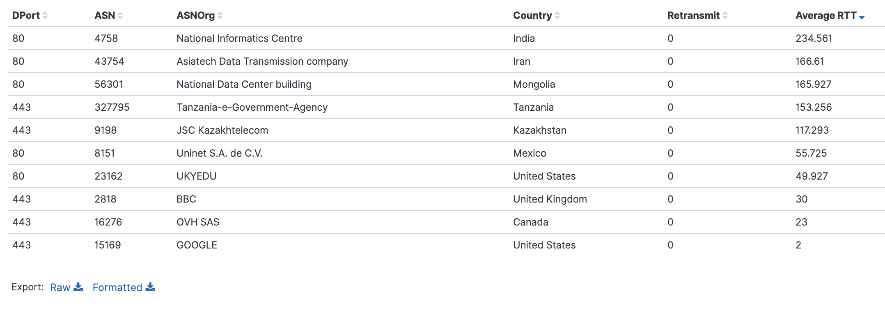

[](https://github.com/mehrdadrad/tcpdog/actions?query=workflow%3Abuild) [](https://goreportcard.com/report/github.com/mehrdadrad/tcpdog)  [](https://coveralls.io/github/mehrdadrad/tcpdog?branch=main) [](https://pkg.go.dev/github.com/mehrdadrad/tcpdog)



TCPDog is a total solution from exporting TCP statistics from Linux kernel by eBPF very efficiently to store them at your Elasticsearch or InfluxDB database with Geo and ASN informations. It can handle all TCP tracepoints at the same time with different customizeable requests through simple yaml configuration. 

### Features
- TCP socket stats by eBPF TCP tracepoints.
- Supports all [TCP tracepoints](https://github.com/mehrdadrad/tcpdog/wiki/tracepoints) simultaneously.
- Customizable [TCP fields](https://github.com/mehrdadrad/tcpdog/wiki/metrics) at kernel space. 
- Ingest to Elasticsearch or InfluxDB.
- Central collection through gRPC or Kafka.
- Supports sampling and filtering at kernel space.
- Supports Geo and ASN by Maxmind.



### Requirements
* Linux kernel versions 4.16 and later
* [Libbcc](https://github.com/mehrdadrad/tcpdog/wiki/install-bcc)

### Documentations
* [Quick start](https://github.com/mehrdadrad/tcpdog/wiki/quick-start)
* [Agent config](https://github.com/mehrdadrad/tcpdog/wiki/agent-config)
* [Server config](https://github.com/mehrdadrad/tcpdog/wiki/server-config)

### Sample Elasticsearch reports
#### Polygon map and table
Once you installed tcpdog on your servers, you can have the end-user perspective using real performance data which they export by tcpdog. It would be very helpful for SRE and network team to optimize and troubleshooting network and applications.




You can see all the current available metrics [here](https://github.com/mehrdadrad/tcpdog/wiki/metrics).

#### Sample JSON Lines output
```json
[RTT,AdvMSS,TotalRetrans,SAddr,DAddr,DPort,LPort,BytesReceived,BytesSent,timestamp]
[172,1460,0,"10.0.2.15","103.17.108.173",80,0,456,73,1612298721]
[55,1460,0,"10.0.2.15","187.141.67.60",80,0,389,74,1612298722]
[140,1460,0,"10.0.2.15","154.118.230.171",443,0,5209,551,1612298723]
[118,1460,0,"10.0.2.15","88.204.157.165",443,0,4445,514,1612298724]
[8,1460,0,"10.0.2.15","47.254.92.5",80,0,760,70,1612298731]
[1,1460,0,"10.0.2.15","184.51.206.209",443,0,4820,577,1612298735]
[238,1460,0,"10.0.2.15","164.100.61.151",80,0,141,71,1612298737]
[171,1460,0,"10.0.2.15","77.238.121.220",80,0,158,74,1612298742]
```

### License
This project is licensed under MIT license. Please read the LICENSE file.

### Contribute
Welcomes any kind of contribution, please follow the next steps:

- Fork the project on github.com.
- Create a new branch.
- Commit changes to the new branch.
- Send a pull request.
